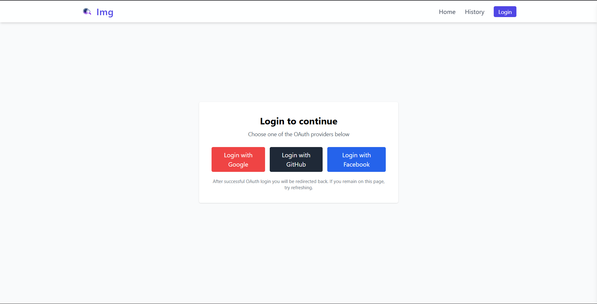
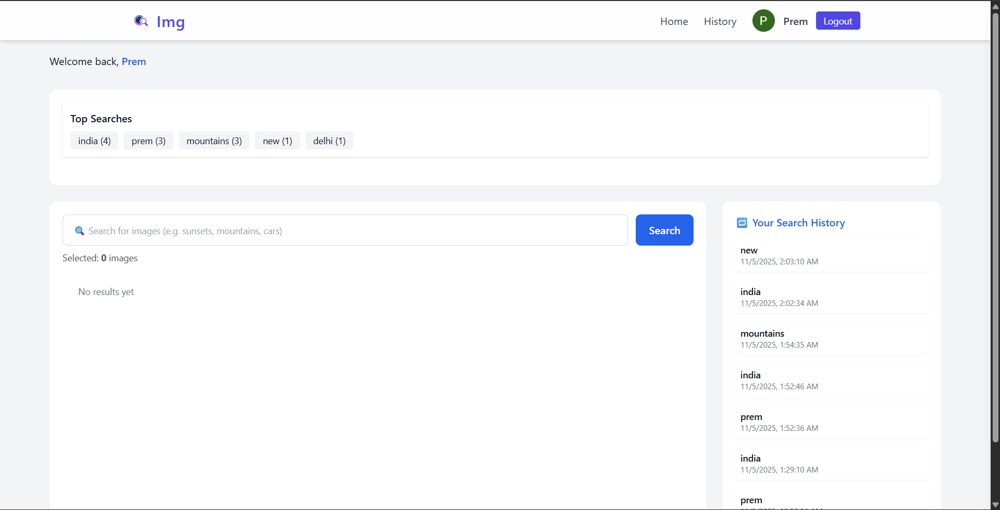
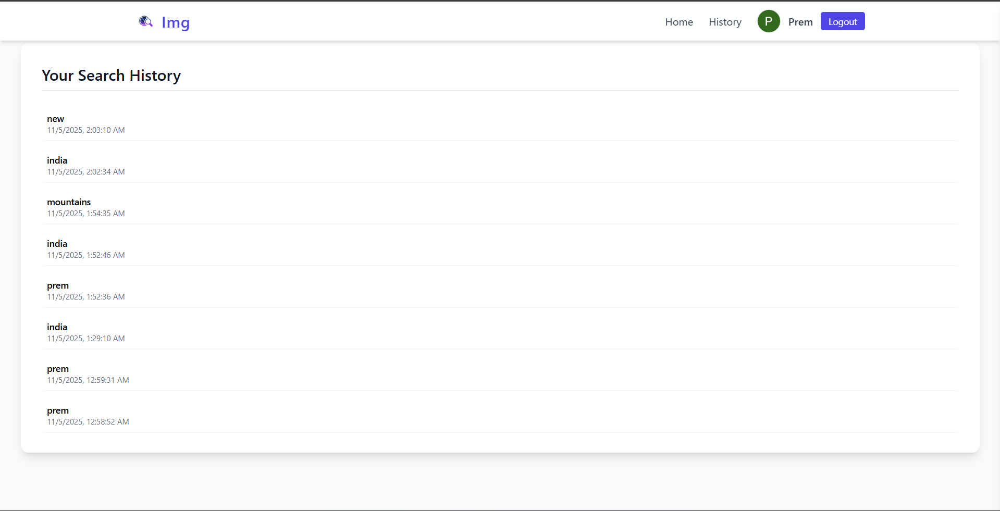

# 🌐 Full Stack Image Search App (Unsplash + OAuth)

A full-stack web application built using **React.js**, **Node.js**, **Express**, and **MongoDB** that allows users to:
- Log in with **Facebook** or **Google** OAuth.
- Search and view images from **Unsplash API**.
- View their **search history**.
- Manage saved searches and personal data.

---

## 🚀 Tech Stack

**Frontend (Client)**
- React.js (Vite)
- Tailwind CSS
- Axios

**Backend (Server)**
- Node.js
- Express.js
- MongoDB + Mongoose
- Passport.js (for OAuth)
- Unsplash API Integration

---

## ⚙️ Setup Instructions

### 1️⃣ Clone the Repository
```bash
git clone https://github.com/prem1kr/Mern-Stack-Oauth-image-search-multiselect-app.git
cd Mern-Stack-Oauth-image-search-multiselect-app
````


Install both client and server packages:

```bash
cd client
npm install

cd ../server
npm install
```

---

### 3️⃣ Create `.env` Files

#### 🖥️ Client (`client/.env`)

VITE_API_BASE_URL=http://localhost:5000
```

#### ⚙️ Server (`server/.env`)

# MongoDB
MONGO_URI=your_mongodb_connection_string

# Unsplash API
UNSPLASH_ACCESS_KEY=your_unsplash_access_key

# OAuth Configuration
GOOGLE_CLIENT_ID=your_google_client_id
GOOGLE_CLIENT_SECRET=your_google_client_secret
GOOGLE_CALLBACK_URL=http://localhost:5000/api/auth/google/callback

# GitHub OAuth
GITHUB_CLIENT_ID=your_google_client_id
GITHUB_CLIENT_SECRET=your_google_client_secret
GITHUB_CALLBACK_URL=http://localhost:5000/api/auth/github/callback

# JWT / Session
SESSION_SECRET=your_session_secret

# Server
PORT=5000
```

## 🗂️ Folder Structure

```
📦 root
├── client/                   # React frontend
│   ├── src/
│   │   ├── api/              # Axios API configurations
│   │   ├── components/       # Reusable UI components (Navbar, SearchGrid, etc.)
│   │   ├── pages/            # Page views (Home, Login, Search, History)
│   │   ├── context/          # React Context API for state management
│   │   ├── App.jsx           # Main React app entry
│   │   └── main.jsx          # React DOM render
│   ├── public/               # Static assets
│   ├── .env
│   └── tailwind.config.js
│
└── server/                   # Express backend
    ├── config/               # Config files (DB, Passport, Unsplash)
    ├── controllers/          # Logic for routes
    ├── middleware/           # Auth middleware
    ├── models/               # Mongoose models (User, Search)
    ├── routes/               # API routes (auth, search, history)
    ├── .env
    └── server.js             # Entry point
```

---

## 🧠 API Overview

Base URL:

```
http://localhost:5000/api
```

### 🔐 Auth Routes (`/api/auth`)

| Method | Endpoint                  | Description                   |
| ------ | ------------------------- | ----------------------------- |
| GET    | `/auth/google`            | Initiate Google OAuth login   |
| GET    | `/auth/google/callback`   | Google OAuth callback         |
| GET    | `/auth/github`          | Initiate Facebook OAuth login |
| GET    | `/auth/github/callback` | Facebook OAuth callback       |
| GET    | `/auth/logout`            | Logout user                   |

---

### 🔍 Search Routes (`/api/search`)

| Method | Endpoint               | Description                    |
| ------ | ---------------------- | ------------------------------ |
| GET    | `/search?query={term}` | Search images from Unsplash    |
| GET    | `/search/:id`          | Get a specific saved search    |

**Example (cURL):**

```bash
curl -X GET "http://localhost:5000/api/search?query=nature" \
-H "Authorization: Bearer <your_token>"
```

---

### 🕓 History Routes (`/api/history`)

| Method | Endpoint       | Description                           |
| ------ | -------------- | ------------------------------------- |
| GET    | `/history`     | Get user search history               |
| DELETE | `/history/:id` | Delete a specific search from history |


## 🧰 Run the App

### 🖥️ Start the backend

```bash
cd server
npm start
```

### 💻 Start the frontend

```bash
cd client
npm run dev
```

Now visit 👉 **[http://localhost:5173]**

---

## 📸 Screenshots






## 👨‍💻 Author

**Your Name**
🔗 [https://github.com/prem1kr]
📧 [prem78334@gmail.com]

